# Konversi Deck List Pokémon TCG Live ⇄ Pokepedia.id / Indonesian Format

[](https://willypt.github.io/ptcg-indo-to-ptcgl/)
[](https://github.com/willypt/ptcg-indo-to-ptcgl)
[](https://asia.pokemon-card.com/id/card-search/)
[](https://tcgdex.dev)

Converts Pokémon TCG deck lists between **Indonesian** prints (regulation H, I, J) and **English / PTCG Live**, both ways.

**[Open the converter](https://willypt.github.io/ptcg-indo-to-ptcgl/)** · **[Watch the demo video](https://willypt.github.io/ptcg-indo-to-ptcgl/media/demo.mp4)**

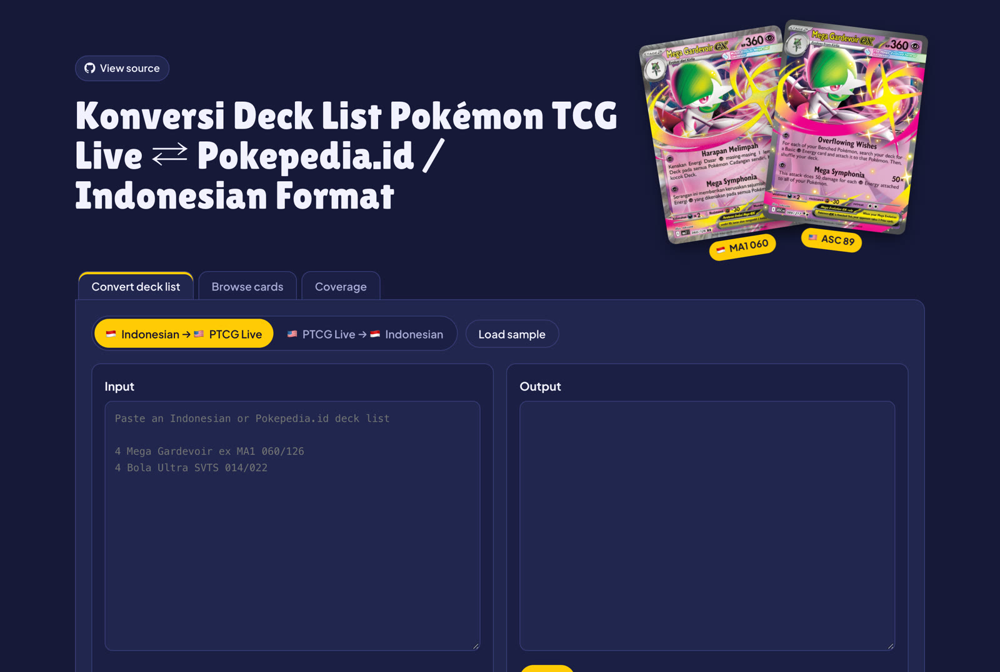

## Demo

From a Pokepedia.id deck to an imported, valid PTCG Live deck. Click to play:

[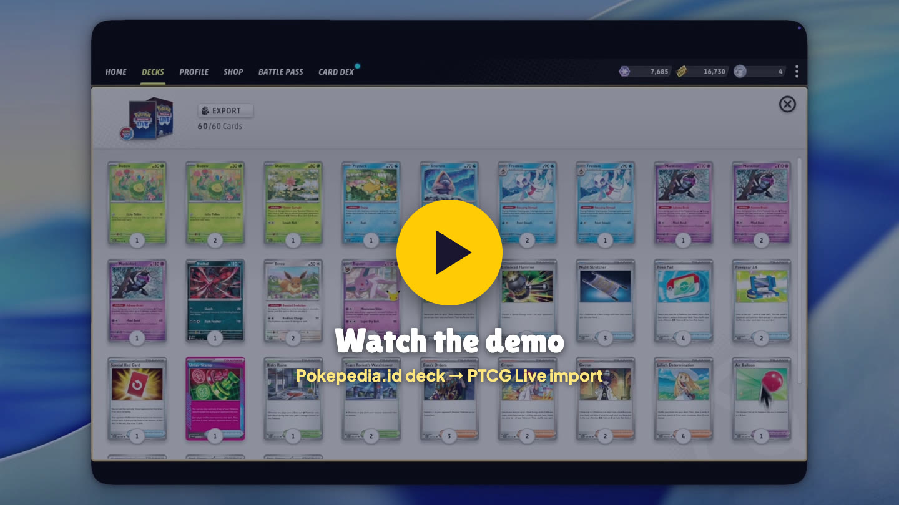](https://willypt.github.io/ptcg-indo-to-ptcgl/media/demo.mp4)

## Features

**Pokepedia.id / Indonesian → PTCG Live.** Paste a list copied from Pokepedia.id (or written with Indonesian set codes) and get a list PTCG Live imports.

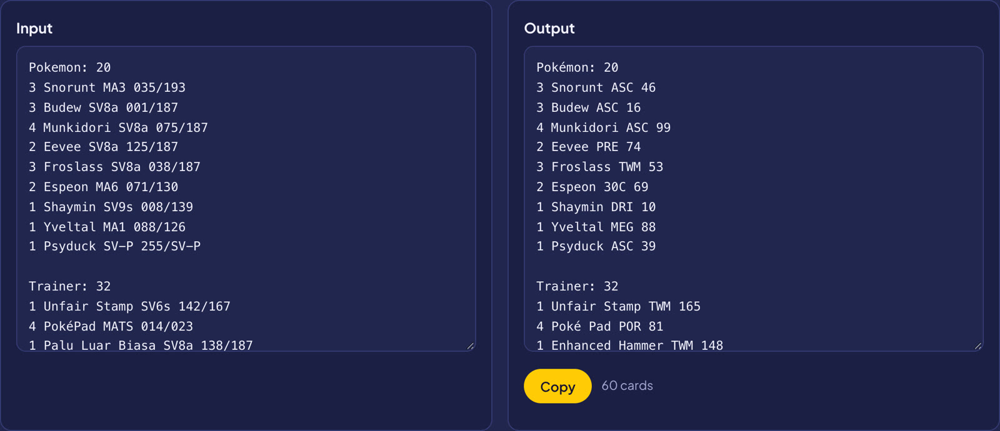

**PTCG Live → Indonesian, in two layouts.** Pokepedia.id's (`035/193`, `[Ghetsis]`, `Total: 60`) or PTCG Live's own with Indonesian sets (`MA3 35`, `Energi Dasar {P}`, `Total Kartu: 60`).

| Pokepedia.id | PTCG Live style |
|---|---|
| 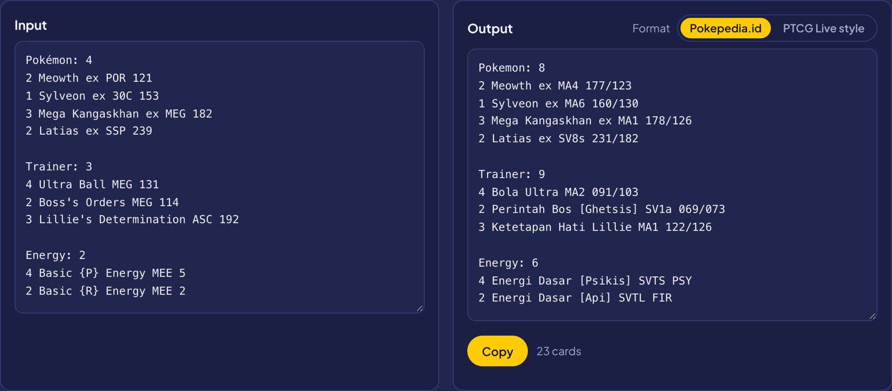 | 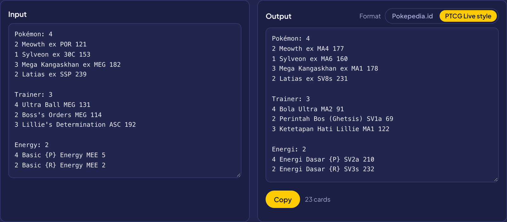 |

**Same card, same art.** Each card converts to the print with the same artwork when one exists, never to a promo when a regular print exists.

**Deck images.** Both decks side by side in the same order. Orange outline = different art; faded = stand-in picture.

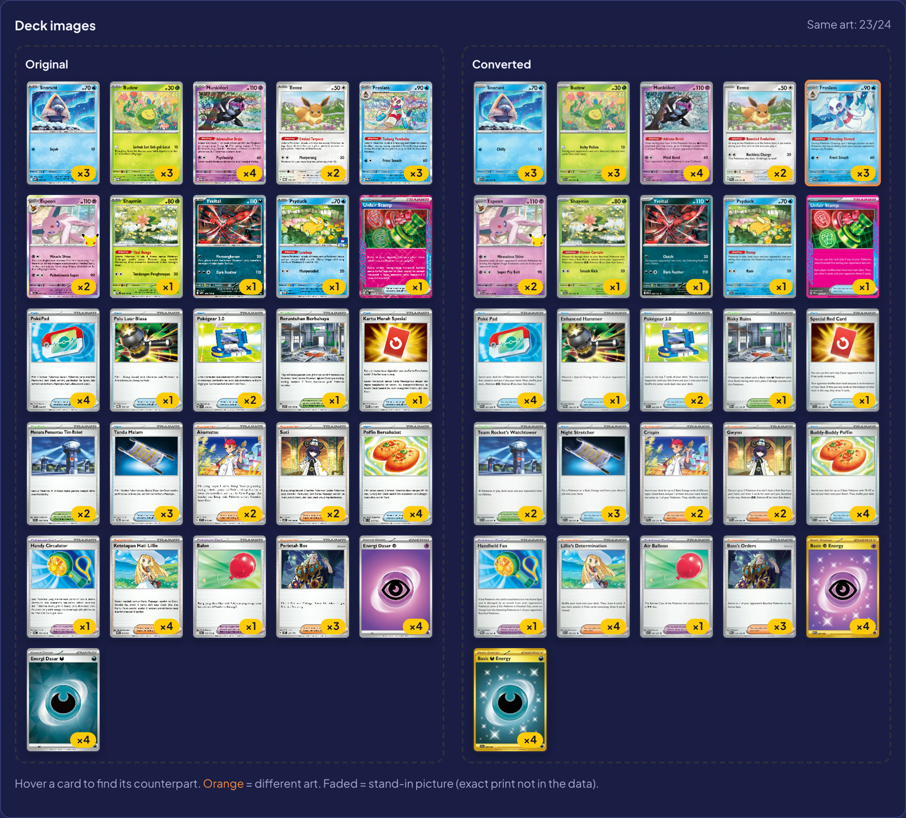

**Card viewer.** Click a card to compare both prints up close. Arrow keys step through the deck.

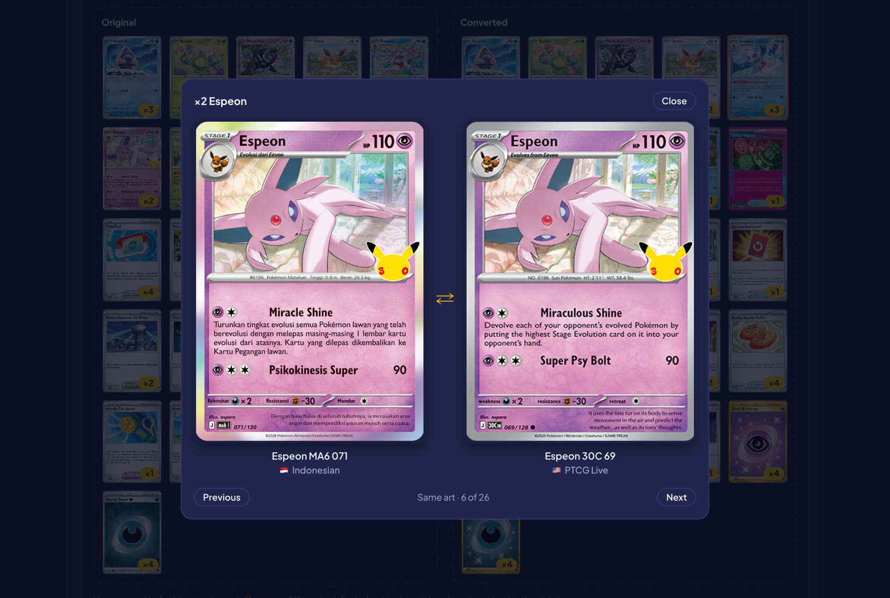

**Separate modes.** Each direction keeps its own boxes, and switching clears them. Paste a list into the wrong mode and the page offers to switch.

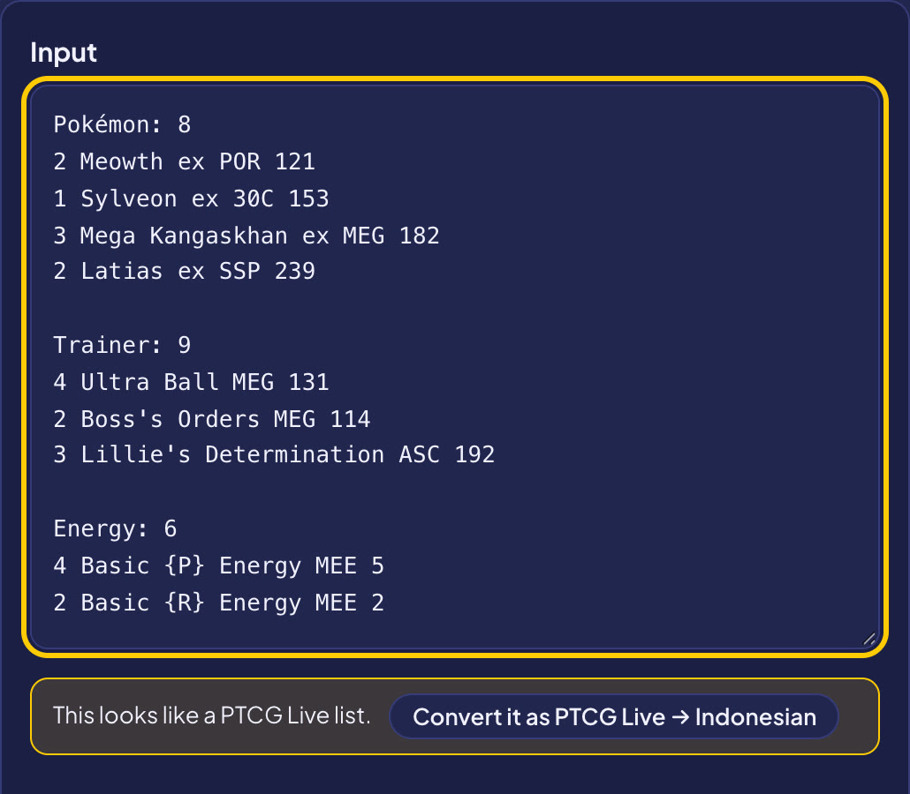

**Browse and coverage.** Search any card in either language, and see which Indonesian prints don't have an English match yet, and why.

| Browse | Coverage |
|---|---|
| 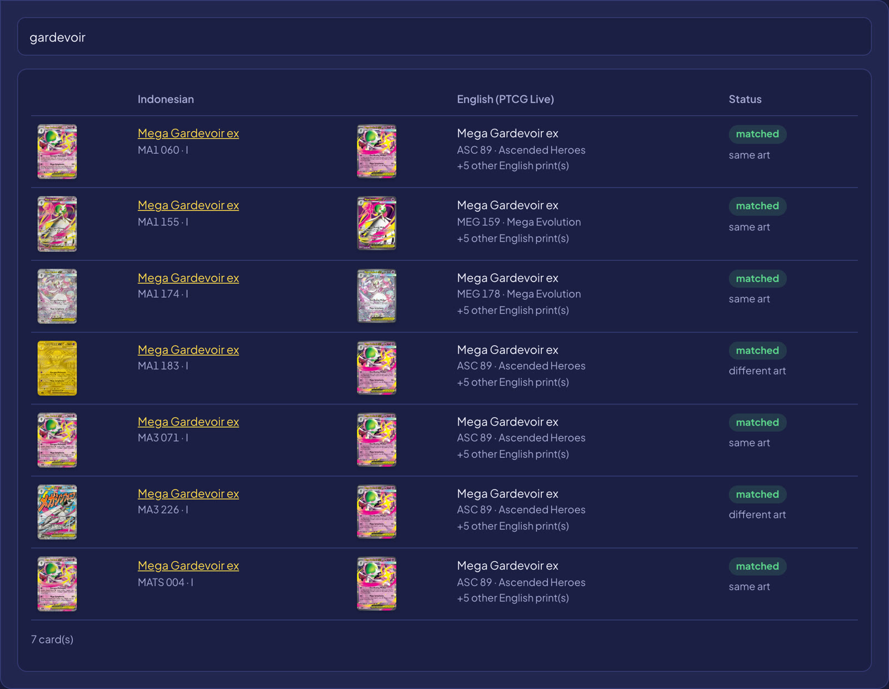 | 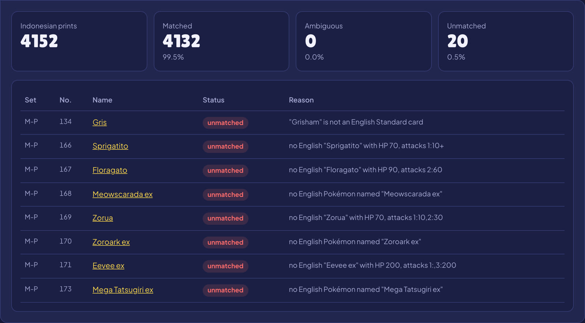 |

Works on phones too.

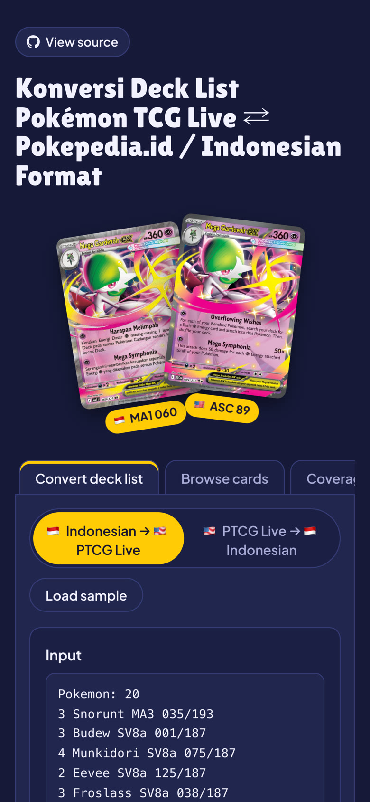

## What's in the repo

- `docs/`: the converter page, served on GitHub Pages
- `data/map.json`: the mapping, for use in other tools
- `data/report.md`: match rate and every unmatched card, with the reason

**Coverage (2026-10-03):** 4,132 of 4,152 Standard Indonesian prints (99.5%) matched; 3,651 also have a same-art English print. The 20 unmatched have no English release yet (Indonesia-only and newest promos).

## How matching works

Indonesian sets follow the Japanese structure, so set codes and numbers don't line up with English (`SV4s 050` Zebstrika = `PAR 63`).

- **Pokémon** keep English names. Same-name candidates are narrowed by HP, retreat, abilities, and each attack's energy count and damage.
- **Trainers and Energy** are translated, so they go through `data/trainer-names.json` ("Bola Nest" = Nest Ball).
- **Name differences** (owners like `<Mistika>` = Iono's, forms like "Ogerpon Topeng Teal") live in `data/pokemon-names.json`.
- **Look-alikes** with identical stats are tie-broken automatically; the rest are pinned in `data/overrides.json`.
- **Exact print:** card art is compared by perceptual hash, so the converter keeps the same artwork where it exists. Otherwise it uses a standard print: never a promo when a regular print exists, and no secret rares.

## Run locally

Needs [Bun](https://bun.sh).

```sh
git clone https://github.com/willypt/ptcg-indo-to-ptcgl.git
cd ptcg-indo-to-ptcgl
bun install
bun run dev        # http://localhost:3000
```

The data is committed, so the converter works right away.

## Updating for a new set

1. `bun run all`: scrape Indonesian cards, fetch English, hash new pictures, rebuild. Only new cards are downloaded.
2. Check `data/report.md` and fix what it lists:

   | Report says | Fix |
   |---|---|
   | `"X" missing from trainer-names.json` | Add `"X": "English Name"` to `data/trainer-names.json`. Check the effect text if the name isn't an obvious translation. |
   | `no English Pokémon named "X"` | Add the owner or form to `data/pokemon-names.json`. |
   | `"X" is not an English Standard card` | English set not out (or not in TCGdex) yet. Nothing to do. |
   | `N different English "X" cards fit equally` | Pin the right one in `data/overrides.json`. |
   | A new English set is missing entirely | TCGdex left it without regulation marks. Add its set id to `UNMARKED_SETS` in `scripts/fetch-en.ts` and `scripts/build-map.ts`. |

3. `bun run build`, then `bun run dev` and test a deck.
4. Push to `main`. GitHub Pages updates in a minute or two.

## Deck formats

- **PTCG Live:** `4 Mega Gardevoir ex MEG 60`. Accepts `Basic {P} Energy`.
- **Pokepedia.id:** `3 Snorunt MA3 035/193`, `Perintah Bos [Ghetsis]`, `Total: 60`.
- **PTCG Live style, Indonesian sets:** `3 Snorunt MA3 35`, `Energi:` header, `Energi Dasar {P} SV2a 210`, `Total Kartu: 60`.

Paste any of them; the direction is detected. Indonesian output can be either of the last two.

## Limits

- Indonesian sets come out first; their cards stay unmatched until the English set exists.
- TCGdex has no pictures of current English basic Energy, so the page shows an older print's picture (the text stays `Basic {P} Energy MEE 5`).
- The Indonesian site isn't an official API; if its HTML changes, update `scripts/scrape-id.ts`.

Inspired by [Pokepedia.id](https://pokepedia.id). Unofficial fan tool, by WillyPT @ [Brewek Santai](https://www.instagram.com/breweksantai). Not affiliated with The Pokémon Company, Nintendo, Creatures or GAME FREAK.
